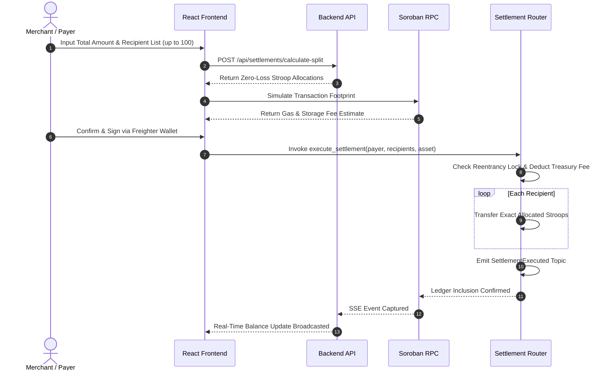
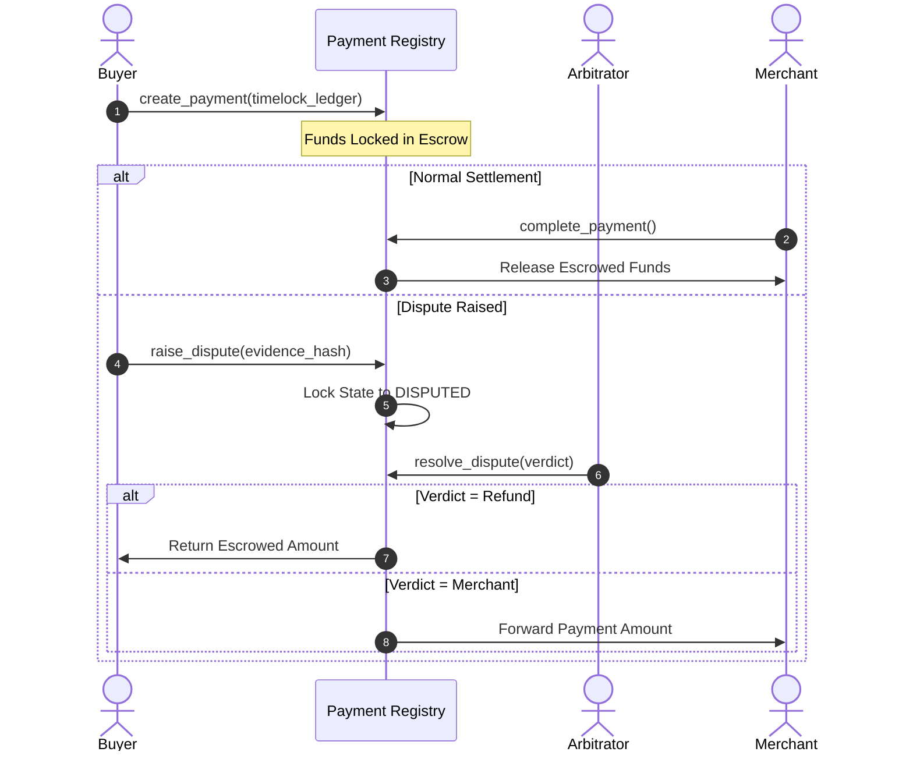

# System Interaction Diagrams

## 1. Atomic Multi-Recipient Settlement Flow

```mermaid
sequenceDiagram
    autonumber
    actor Merchant as Merchant / Payer
    participant Web as React Frontend
    participant API as Backend API
    participant RPC as Soroban RPC
    participant Contract as Settlement Router

    Merchant->>Web: Input Total Amount & Recipient List (up to 100)
    Web->>API: POST /api/settlements/calculate-split
    API-->>Web: Return Zero-Loss Stroop Allocations
    Web->>RPC: Simulate Transaction Footprint
    RPC-->>Web: Return Gas & Storage Fee Estimate
    Merchant->>Web: Confirm & Sign via Freighter Wallet
    Web->>Contract: Invoke execute_settlement(payer, recipients, asset)
    Contract->>Contract: Check Reentrancy Lock & Deduct Treasury Fee
    loop Each Recipient
        Contract->>Contract: Transfer Exact Allocated Stroops
    end
    Contract->>Contract: Emit SettlementExecuted Topic
    Contract-->>RPC: Ledger Inclusion Confirmed
    RPC-->>API: SSE Event Captured
    API-->>Web: Real-Time Balance Update Broadcasted
```

## 2. Timelocked Escrow & Dispute Resolution Lifecycle

```mermaid
sequenceDiagram
    autonumber
    actor Buyer as Buyer
    participant Contract as Payment Registry
    actor Arbitrator as Arbitrator
    actor Merchant as Merchant

    Buyer->>Contract: create_payment(timelock_ledger)
    Note over Contract: Funds Locked in Escrow
    alt Normal Settlement
        Merchant->>Contract: complete_payment()
        Contract->>Merchant: Release Escrowed Funds
    else Dispute Raised
        Buyer->>Contract: raise_dispute(evidence_hash)
        Contract->>Contract: Lock State to DISPUTED
        Arbitrator->>Contract: resolve_dispute(verdict)
        alt Verdict = Refund
            Contract->>Buyer: Return Escrowed Amount
        else Verdict = Merchant
            Contract->>Merchant: Forward Payment Amount
        end
    end
```
